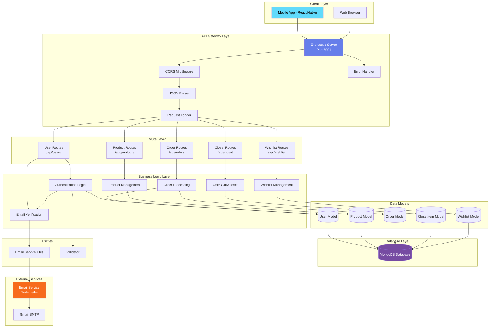

# Lufyco Clothing Backend Architecture

## Architecture Diagram



---

## Detailed Architecture Explanation

### 1. **Client Layer**
The frontend clients that interact with the backend API:
- **Mobile App**: React Native/Expo application for iOS and Android
- **Web Browser**: Web-based interface (if applicable)

Both clients communicate with the backend via RESTful API calls over HTTP/HTTPS.

---

### 2. **API Gateway Layer** (Express.js Server)

The Express.js server acts as the central API gateway running on **Port 5001** (configurable via environment variables).

#### Key Components:

**Middleware Stack:**
- **CORS Middleware**: Enables cross-origin resource sharing for the frontend apps
- **JSON Parser**: Parses incoming JSON request bodies
- **Request Logger**: Logs all incoming HTTP requests (`method + URL`)
- **Error Handler**: Global error handling middleware that catches and formats errors

**Server Entry Point:** `server.js`
```javascript
const app = express();
app.use(cors());
app.use(express.json());
app.use(requestLogger);
```

---

### 3. **Route Layer** (API Endpoints)

The backend exposes 5 main route modules, each handling specific domains:

| Route | Endpoint | Responsibility |
|-------|----------|----------------|
| **User Routes** | `/api/users` | Authentication, registration, email verification, password reset |
| **Product Routes** | `/api/products` | Product listing, search, filtering, product details |
| **Order Routes** | `/api/orders` | Order creation, order history, order management |
| **Closet Routes** | `/api/closet` | User's cart/shopping bag management |
| **Wishlist Routes** | `/api/wishlist` | User's wishlist/favorites management |

---

### 4. **Business Logic Layer**

This layer contains the core application logic and orchestrates data flow between routes and models.

#### **Authentication Logic** (`userRoutes.js`)
- User registration with email verification
- Login with email/password
- Offline/backdoor login (`user/user`) for testing
- Forgot password with OTP
- Email verification system
- Password reset functionality

**Key Features:**
- Email validation using the `validator` library
- Supported email providers whitelist (Gmail, Yahoo, Outlook, etc.)
- OTP generation (6-digit codes with 10-minute expiry)
- User verification status tracking

#### **Email Verification System**
- OTP-based email verification
- Resend OTP functionality
- Expiry handling (10 minutes)
- HTML email templates with branded styling

#### **Product Management**
- Product CRUD operations
- Category filtering
- Search functionality
- Inventory management

#### **Order Processing**
- Order creation from cart
- Order status tracking
- Order history retrieval
- Payment tracking

#### **User Cart/Closet**
- Add/remove items from cart
- Update quantity
- Cart persistence per user

#### **Wishlist Management**
- Add/remove favorite products
- Wishlist retrieval
- Sync across devices

---

### 5. **Data Models** (Mongoose Schemas)

The application uses **5 Mongoose models** to define data structures:

#### **User Model** (`User.js`)
```javascript
{
  name: String,
  phone: String,
  email: String (unique, required),
  password: String,
  isVerified: Boolean,
  verificationOTP: String,
  otpExpiry: Date,
  isAdmin: Boolean
}
```

#### **Product Model** (`Product.js`)
```javascript
{
  name: String,
  description: String,
  price: Number,
  category: String,
  image: String,
  stock: Number,
  rating: Number,
  reviews: Array
}
```

#### **Order Model** (`Order.js`)
```javascript
{
  user: ObjectId (ref: User),
  orderItems: Array,
  shippingAddress: Object,
  paymentMethod: String,
  totalPrice: Number,
  isPaid: Boolean,
  paidAt: Date,
  isDelivered: Boolean,
  deliveredAt: Date
}
```

#### **ClosetItem Model** (`ClosetItem.js`)
User's shopping cart items

#### **Wishlist Model** (`Wishlist.js`)
User's wishlist/favorites

---

### 6. **Database Layer** (MongoDB)

**Database**: MongoDB (NoSQL document database)

**Connection**: Mongoose ODM for MongoDB
- Connection managed in `config/db.js`
- Graceful error handling (server stays running even if DB connection fails)
- Support for offline mode

**Key Features:**
- Document-based data storage
- Flexible schema design
- Fast read/write operations
- Scalable for e-commerce workloads

---

### 7. **External Services**

#### **Email Service** (Nodemailer + Gmail SMTP)
- **Library**: Nodemailer v7.0.13
- **Provider**: Gmail SMTP (configurable)
- **Purpose**: Sending transactional emails
  - Email verification OTPs
  - Password reset codes
  - Order confirmations (future)

**Configuration** (via environment variables):
```
EMAIL_SERVICE=gmail
EMAIL_USER=your_email@gmail.com
EMAIL_PASSWORD=app_specific_password
```

**Email Templates:**
- Branded HTML emails with gradient headers
- Purple/blue theme matching app branding (#667eea, #764ba2)
- Responsive design
- OTP display with large, clear fonts

---

### 8. **Utilities**

#### **Email Service Utils** (`utils/emailService.js`)
- `generateOTP()`: Generates 6-digit OTP codes
- `sendVerificationEmail()`: Sends branded verification emails
- Email template management

#### **Validator**
- Email format validation
- Password strength validation
- Input sanitization

---

## Data Flow Examples

### **Example 1: User Registration Flow**

```
1. User submits registration form (name, email, password)
   ↓
2. POST /api/users/register
   ↓
3. Validate input (email format, required fields)
   ↓
4. Check if user exists in MongoDB
   ↓
5. Generate 6-digit OTP + expiry time (10 min)
   ↓
6. Create User document with isVerified=false
   ↓
7. Send verification email via Nodemailer
   ↓
8. Return success response to client
   ↓
9. User enters OTP in app
   ↓
10. POST /api/users/verify-email
   ↓
11. Verify OTP and expiry
   ↓
12. Update user.isVerified = true
   ↓
13. User can now login
```

### **Example 2: Product Browsing Flow**

```
1. User opens product listing screen
   ↓
2. GET /api/products
   ↓
3. Query MongoDB Product collection
   ↓
4. Apply filters (category, price, etc.)
   ↓
5. Return product array to client
   ↓
6. Frontend displays products in grid
```

### **Example 3: Add to Cart Flow**

```
1. User clicks "Add to Cart" on product
   ↓
2. POST /api/closet (with productId, quantity)
   ↓
3. Check if product exists
   ↓
4. Check stock availability
   ↓
5. Create/update ClosetItem document
   ↓
6. Return updated cart to client
```

---

## Technology Stack Summary

| Layer | Technology | Version |
|-------|-----------|---------|
| **Runtime** | Node.js | - |
| **Framework** | Express.js | 5.2.1 |
| **Database** | MongoDB | - |
| **ODM** | Mongoose | 9.1.3 |
| **Email** | Nodemailer | 7.0.13 |
| **Validation** | Validator | 13.15.26 |
| **Environment** | dotenv | 17.2.3 |
| **Dev Tool** | Nodemon | 3.1.11 |
| **Middleware** | CORS | 2.8.5 |

---

## Security Considerations

> [!WARNING]
> **Current Implementation (Development Mode)**

The current backend has some security concerns that need addressing before production:

1. **Passwords stored in plain text** - Should use bcrypt hashing
2. **No JWT authentication** - Should implement token-based auth
3. **No rate limiting** - Vulnerable to brute force attacks
4. **No input sanitization** - Risk of injection attacks
5. **Backdoor login** (`user/user`) - Should be removed in production

> [!IMPORTANT]
> **Recommended Production Enhancements**

- Add **bcrypt** for password hashing
- Implement **JWT** (JSON Web Tokens) for stateless authentication
- Add **express-rate-limit** for API rate limiting
- Use **helmet** for security headers
- Add **express-validator** for comprehensive input validation
- Enable **HTTPS only** in production
- Implement **refresh tokens** for better session management

---

## Environment Variables

The backend requires the following environment variables (`.env` file):

```env
# Server Configuration
PORT=5001
NODE_ENV=development

# Database
MONGO_URI=mongodb://localhost:27017/lufyco_clothing

# Email Service (Gmail)
EMAIL_SERVICE=gmail
EMAIL_USER=your_email@gmail.com
EMAIL_PASSWORD=your_app_specific_password
```

---

## Offline Mode

The backend supports **offline mode** for development/testing:

**Offline Login Credentials:**
- Email: `user` (case-insensitive)
- Password: `user`

Returns a dummy user object without database connection:
```javascript
{
  _id: 'dummy_user_id',
  name: 'Offline User',
  email: 'user',
  isAdmin: false,
  token: 'offline-token-123'
}
```

**Database Resilience:**
- Server continues running even if MongoDB connection fails
- Graceful error handling in `connectDB()` function

---

## API Endpoints Summary

### **User Routes** (`/api/users`)
- `POST /register` - Register new user + send OTP
- `POST /verify-email` - Verify email with OTP
- `POST /resend-otp` - Resend verification OTP
- `POST /login` - Login user
- `POST /forgot-password` - Request password reset OTP
- `POST /verify-reset-otp` - Verify password reset OTP
- `POST /reset-password` - Reset password

### **Product Routes** (`/api/products`)
- `GET /` - Get all products
- `GET /:id` - Get single product
- `POST /` - Create product (admin)
- `PUT /:id` - Update product (admin)
- `DELETE /:id` - Delete product (admin)

### **Order Routes** (`/api/orders`)
- `POST /` - Create new order
- `GET /myorders` - Get user's orders
- `GET /:id` - Get order by ID

### **Closet Routes** (`/api/closet`)
- `GET /` - Get user's cart
- `POST /` - Add item to cart
- `PUT /:id` - Update cart item
- `DELETE /:id` - Remove from cart

### **Wishlist Routes** (`/api/wishlist`)
- `GET /` - Get user's wishlist
- `POST /` - Add to wishlist
- `DELETE /:id` - Remove from wishlist

---

## Scalability Considerations

### **Current Architecture**
- Monolithic Node.js application
- Single database connection
- Synchronous email sending

### **Future Scalability Options**

1. **Horizontal Scaling**
   - Deploy multiple server instances behind a load balancer
   - Use session stores (Redis) for shared state

2. **Database Optimization**
   - Add database indexing on frequently queried fields
   - Implement database connection pooling
   - Consider read replicas for heavy read operations

3. **Async Processing**
   - Move email sending to background queue (Bull/RabbitMQ)
   - Implement job workers for order processing

4. **Caching Layer**
   - Add Redis for product caching
   - Cache frequently accessed data

5. **Microservices Migration**
   - Split into auth, products, orders services
   - Use API Gateway pattern

---

## Development Workflow

### **Starting the Server**

```bash
# Install dependencies
npm install

# Start in development mode (with auto-reload)
npm run dev

# Start in production mode
npm start
```

### **Seeding Data**

```bash
# Seed products
node seed_products_v2.js

# Seed test users
node seed_users.js
```

### **Testing Utilities**

```bash
# Check all users
node check_all_users.js

# Check specific user
node check_user.js

# Test login
node test_login.js
```

---

## Error Handling

The backend implements **global error handling**:

```javascript
app.use((err, req, res, next) => {
  console.error("Global Server Error:", err.stack);
  res.status(500).json({
    message: 'Internal Server Error',
    error: process.env.NODE_ENV === 'production' ? {} : err.message
  });
});
```

**Features:**
- Centralized error logging
- Environment-aware error responses (detailed in dev, minimal in prod)
- 500 status code for unhandled errors
- Stack traces in development mode

---

## Logging

**Request Logging:**
```javascript
app.use((req, res, next) => {
  console.log(`${req.method} ${req.url}`);
  next();
});
```

Logs every incoming request with HTTP method and URL.

**Database Connection Logging:**
- MongoDB connection success/failure
- Connection host information

**Email Service Logging:**
- OTP sending success/failure
- Recipient email addresses

---

## Conclusion

The Lufyco Clothing backend is a **well-structured RESTful API** built with Node.js and Express.js, following a clean **layered architecture**. It provides comprehensive e-commerce functionality including:

✅ User authentication with email verification  
✅ Product catalog management  
✅ Shopping cart and wishlist  
✅ Order processing  
✅ Email notifications  
✅ Offline development mode  

The architecture is designed for **rapid development** with room for **production enhancements** in security, scalability, and performance.
