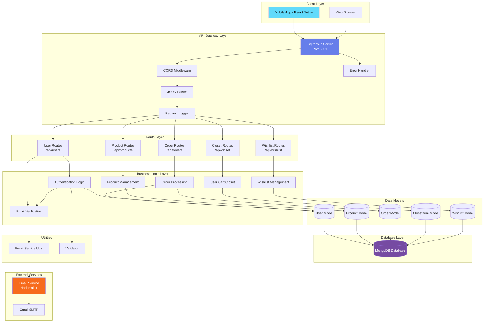

# Lufyco Clothing Backend Architecture

## Architecture Diagram



---

## Detailed Architecture Explanation

### 1. **Client Layer**
The frontend clients that interact with the backend API:
- **Mobile App**: React Native/Expo application for iOS and Android
- **Web Browser**: Web-based interface (if applicable)

Both clients communicate with the backend via RESTful API calls over HTTP/HTTPS.

---

### 2. **API Gateway Layer** (Express.js Server)

The Express.js server acts as the central API gateway running on **Port 5001** (configurable via environment variables).

#### Key Components:

**Middleware Stack:**
- **CORS Middleware**: Enables cross-origin resource sharing for the frontend apps
- **JSON Parser**: Parses incoming JSON request bodies
- **Request Logger**: Logs all incoming HTTP requests (`method + URL`)
- **Error Handler**: Global error handling middleware that catches and formats errors

**Server Entry Point:** `server.js`
```javascript
const app = express();
app.use(cors());
app.use(express.json());
app.use(requestLogger);
```

---

### 3. **Route Layer** (API Endpoints)

The backend exposes 5 main route modules, each handling specific domains:

| Route | Endpoint | Responsibility |
|-------|----------|----------------|
| **User Routes** | `/api/users` | Authentication, registration, email verification, password reset |
| **Product Routes** | `/api/products` | Product listing, search, filtering, product details |
| **Order Routes** | `/api/orders` | Order creation, order history, order management |
| **Closet Routes** | `/api/closet` | User's cart/shopping bag management |
| **Wishlist Routes** | `/api/wishlist` | User's wishlist/favorites management |

---

### 4. **Business Logic Layer**

This layer contains the core application logic and orchestrates data flow between routes and models.

#### **Authentication Logic** (`userRoutes.js`)
- User registration with email verification
- Login with email/password
- Offline/backdoor login (`user/user`) for testing
- Forgot password with OTP
- Email verification system
- Password reset functionality

**Key Features:**
- Email validation using the `validator` library
- Supported email providers whitelist (Gmail, Yahoo, Outlook, etc.)
- OTP generation (6-digit codes with 10-minute expiry)
- User verification status tracking

#### **Email Verification System**
- OTP-based email verification
- Resend OTP functionality
- Expiry handling (10 minutes)
- HTML email templates with branded styling

#### **Product Management**
- Product CRUD operations
- Category filtering
- Search functionality
- Inventory management

#### **Order Processing**
- Order creation from cart
- Order status tracking
- Order history retrieval
- Payment tracking

#### **User Cart/Closet**
- Add/remove items from cart
- Update quantity
- Cart persistence per user

#### **Wishlist Management**
- Add/remove favorite products
- Wishlist retrieval
- Sync across devices

---

### 5. **Data Models** (Mongoose Schemas)

The application uses **5 Mongoose models** to define data structures:

#### **User Model** (`User.js`)
```javascript
{
  name: String,
  phone: String,
  email: String (unique, required),
  password: String,
  isVerified: Boolean,
  verificationOTP: String,
  otpExpiry: Date,
  isAdmin: Boolean
}
```

#### **Product Model** (`Product.js`)
```javascript
{
  name: String,
  description: String,
  price: Number,
  category: String,
  image: String,
  stock: Number,
  rating: Number,
  reviews: Array
}
```

#### **Order Model** (`Order.js`)
```javascript
{
  user: ObjectId (ref: User),
  orderItems: Array,
  shippingAddress: Object,
  paymentMethod: String,
  totalPrice: Number,
  isPaid: Boolean,
  paidAt: Date,
  isDelivered: Boolean,
  deliveredAt: Date
}
```

#### **ClosetItem Model** (`ClosetItem.js`)
User's shopping cart items

#### **Wishlist Model** (`Wishlist.js`)
User's wishlist/favorites

---

### 6. **Database Layer** (MongoDB)

**Database**: MongoDB (NoSQL document database)

**Connection**: Mongoose ODM for MongoDB
- Connection managed in `config/db.js`
- Graceful error handling (server stays running even if DB connection fails)
- Support for offline mode

**Key Features:**
- Document-based data storage
- Flexible schema design
- Fast read/write operations
- Scalable for e-commerce workloads

---

### 7. **External Services**

#### **Email Service** (Nodemailer + Gmail SMTP)
- **Library**: Nodemailer v7.0.13
- **Provider**: Gmail SMTP (configurable)
- **Purpose**: Sending transactional emails
  - Email verification OTPs
  - Password reset codes
  - Order confirmations (future)

**Configuration** (via environment variables):
```
EMAIL_SERVICE=gmail
EMAIL_USER=your_email@gmail.com
EMAIL_PASSWORD=app_specific_password
```

**Email Templates:**
- Branded HTML emails with gradient headers
- Purple/blue theme matching app branding (#667eea, #764ba2)
- Responsive design
- OTP display with large, clear fonts

---

### 8. **Utilities**

#### **Email Service Utils** (`utils/emailService.js`)
- `generateOTP()`: Generates 6-digit OTP codes
- `sendVerificationEmail()`: Sends branded verification emails
- Email template management

#### **Validator**
- Email format validation
- Password strength validation
- Input sanitization

---

## Data Flow Examples

### **Example 1: User Registration Flow**

```
1. User submits registration form (name, email, password)
   ↓
2. POST /api/users/register
   ↓
3. Validate input (email format, required fields)
   ↓
4. Check if user exists in MongoDB
   ↓
5. Generate 6-digit OTP + expiry time (10 min)
   ↓
6. Create User document with isVerified=false
   ↓
7. Send verification email via Nodemailer
   ↓
8. Return success response to client
   ↓
9. User enters OTP in app
   ↓
10. POST /api/users/verify-email
   ↓
11. Verify OTP and expiry
   ↓
12. Update user.isVerified = true
   ↓
13. User can now login
```

### **Example 2: Product Browsing Flow**

```
1. User opens product listing screen
   ↓
2. GET /api/products
   ↓
3. Query MongoDB Product collection
   ↓
4. Apply filters (category, price, etc.)
   ↓
5. Return product array to client
   ↓
6. Frontend displays products in grid
```

### **Example 3: Add to Cart Flow**

```
1. User clicks "Add to Cart" on product
   ↓
2. POST /api/closet (with productId, quantity)
   ↓
3. Check if product exists
   ↓
4. Check stock availability
   ↓
5. Create/update ClosetItem document
   ↓
6. Return updated cart to client
```

---

## Technology Stack Summary

| Layer | Technology | Version |
|-------|-----------|---------|
| **Runtime** | Node.js | - |
| **Framework** | Express.js | 5.2.1 |
| **Database** | MongoDB | - |
| **ODM** | Mongoose | 9.1.3 |
| **Email** | Nodemailer | 7.0.13 |
| **Validation** | Validator | 13.15.26 |
| **Environment** | dotenv | 17.2.3 |
| **Dev Tool** | Nodemon | 3.1.11 |
| **Middleware** | CORS | 2.8.5 |

---

## Security Considerations

> [!WARNING]
> **Current Implementation (Development Mode)**

The current backend has some security concerns that need addressing before production:

1. **Passwords stored in plain text** - Should use bcrypt hashing
2. **No JWT authentication** - Should implement token-based auth
3. **No rate limiting** - Vulnerable to brute force attacks
4. **No input sanitization** - Risk of injection attacks
5. **Backdoor login** (`user/user`) - Should be removed in production

> [!IMPORTANT]
> **Recommended Production Enhancements**

- Add **bcrypt** for password hashing
- Implement **JWT** (JSON Web Tokens) for stateless authentication
- Add **express-rate-limit** for API rate limiting
- Use **helmet** for security headers
- Add **express-validator** for comprehensive input validation
- Enable **HTTPS only** in production
- Implement **refresh tokens** for better session management

---

## Environment Variables

The backend requires the following environment variables (`.env` file):

```env
# Server Configuration
PORT=5001
NODE_ENV=development

# Database
MONGO_URI=mongodb://localhost:27017/lufyco_clothing

# Email Service (Gmail)
EMAIL_SERVICE=gmail
EMAIL_USER=your_email@gmail.com
EMAIL_PASSWORD=your_app_specific_password
```

---

## Offline Mode

The backend supports **offline mode** for development/testing:

**Offline Login Credentials:**
- Email: `user` (case-insensitive)
- Password: `user`

Returns a dummy user object without database connection:
```javascript
{
  _id: 'dummy_user_id',
  name: 'Offline User',
  email: 'user',
  isAdmin: false,
  token: 'offline-token-123'
}
```

**Database Resilience:**
- Server continues running even if MongoDB connection fails
- Graceful error handling in `connectDB()` function

---

## API Endpoints - Complete Reference

### **User Routes** (`/api/users`)

#### Authentication Endpoints

| Endpoint | Method | Description | Request Body | Response |
|----------|--------|-------------|--------------|----------|
| `/register` | POST | Register new user + send OTP | `{ name, phone, email, password }` | `{ message, requiresVerification, email }` |
| `/verify-email` | POST | Verify email with OTP | `{ email, otp }` | `{ message, verified }` |
| `/resend-otp` | POST | Resend verification OTP | `{ email }` | `{ message }` |
| `/login` | POST | Login user | `{ email, password }` | `{ _id, name, email, isAdmin, token? }` |

**Special Login Credentials (Offline Mode):**
- Email: `user` (case-insensitive)
- Password: `user`
- Returns: `{ _id: 'dummy_user_id', name: 'Offline User', email: 'user', token: 'offline-token-123' }`

#### Password Reset Endpoints

| Endpoint | Method | Description | Request Body | Response |
|----------|--------|-------------|--------------|----------|
| `/forgot-password` | POST | Request password reset OTP | `{ email }` | `{ message, email }` |
| `/verify-reset-otp` | POST | Verify password reset OTP | `{ email, otp }` | `{ message, verified }` |
| `/reset-password` | POST | Reset password with OTP | `{ email, otp, newPassword }` | `{ message, success }` |

**Validation Rules:**
- Email must be valid format (validated with `validator` library)
- Supported email providers: Gmail, Yahoo, Outlook, Hotmail, iCloud, ProtonMail, AOL, Mail.com, Zoho
- Password minimum length: 6 characters
- OTP expiry: 10 minutes
- OTP format: 6-digit numeric code

---

### **Product Routes** (`/api/products`)

#### Get All Products with Advanced Filtering

**Endpoint:** `GET /api/products`

**Query Parameters:**
| Parameter | Type | Description | Example |
|-----------|------|-------------|---------|
| `gender` | String | Filter by gender | `?gender=Men` |
| `category` | String | Filter by category | `?category=Clothing` |
| `subCategory` | String | Filter by subcategory | `?subCategory=Tops` |
| `type` | String | Filter by type | `?type=T-Shirt` |
| `search` | String | Search in name/description | `?search=blue shirt` |
| `isSale` | Boolean | Filter sale items | `?isSale=true` |
| `sort` | String | Sort results | `?sort=price_low_to_high` |

**Sort Options:**
- `price_low_to_high` - Ascending price
- `price_high_to_low` - Descending price
- `whats_new` - Latest products (by `createdAt`)
- `popularity` - Most reviewed (by `reviewsCount`)

**Example Request:**
```
GET /api/products?gender=Men&category=Clothing&sort=price_low_to_high&search=casual
```

**Response:**
```json
[
  {
    "_id": "507f1f77bcf86cd799439011",
    "name": "Casual Blue Shirt",
    "price": 29.99,
    "compareAtPrice": 49.99,
    "description": "Comfortable cotton shirt",
    "image": "https://example.com/shirt.jpg",
    "category": "Clothing",
    "subCategory": "Tops",
    "type": "Shirt",
    "gender": "Men",
    "stock": 50,
    "reviewsCount": 120,
    "rating": 4.5,
    "createdAt": "2026-01-15T10:30:00Z"
  }
]
```

#### Create Product

**Endpoint:** `POST /api/products`

**Request Body:**
```json
{
  "name": "Product Name",
  "price": 49.99,
  "description": "Product description",
  "image": "image_url",
  "category": "Category name"
}
```

**Response:** `201 Created` with product object

---

### **Order Routes** (`/api/orders`)

#### Create New Order

**Endpoint:** `POST /api/orders`

**Request Body:**
```json
{
  "user": "user_id",
  "orderItems": [
    {
      "name": "Product Name",
      "qty": 2,
      "image": "image_url",
      "price": 29.99,
      "product": "product_id"
    }
  ],
  "shippingAddress": {
    "address": "123 Main St",
    "city": "Colombo",
    "postalCode": "10100",
    "country": "Sri Lanka"
  },
  "paymentMethod": "Card",
  "itemsPrice": 59.98,
  "taxPrice": 5.99,
  "shippingPrice": 10.00,
  "totalPrice": 75.97
}
```

**Response:** `201 Created` with order object

#### Get User Orders

**Endpoint:** `GET /api/orders/myorders?userId={userId}`

**Query Parameters:**
- `userId` (required) - User ID to fetch orders for

**Response:**
```json
[
  {
    "_id": "order_id",
    "user": "user_id",
    "orderItems": [...],
    "shippingAddress": {...},
    "paymentMethod": "Card",
    "totalPrice": 75.97,
    "isPaid": false,
    "isDelivered": false,
    "createdAt": "2026-02-11T15:30:00Z"
  }
]
```

---

### **Closet Routes** (`/api/closet`)

Virtual wardrobe management for users.

#### Get Closet Items

**Endpoint:** `GET /api/closet`

**Query Parameters:**
| Parameter | Type | Description |
|-----------|------|-------------|
| `userId` | String | Filter by user ID |
| `category` | String | Filter by category (e.g., "Tops", "Bottoms") |
| `search` | String | Search by item name |

**Example:**
```
GET /api/closet?userId=123&category=Tops&search=shirt
```

**Response:**
```json
[
  {
    "_id": "item_id",
    "user": "user_id",
    "name": "Blue Casual Shirt",
    "category": "Tops",
    "image": "image_url",
    "notes": "Bought for office meetings",
    "createdAt": "2026-02-01T10:00:00Z"
  }
]
```

#### Add to Closet

**Endpoint:** `POST /api/closet`

**Request Body:**
```json
{
  "userId": "user_id",
  "name": "Item name",
  "category": "Tops",
  "image": "image_url",
  "notes": "Optional notes"
}
```

**Response:** `201 Created` with closet item

#### Delete from Closet

**Endpoint:** `DELETE /api/closet/:id`

**Response:** `{ message: 'Item removed' }`

---

### **Wishlist Routes** (`/api/wishlist`)

User's saved favorite products.

#### Get Wishlist Items

**Endpoint:** `GET /api/wishlist?userId={userId}`

**Response:**
```json
[
  {
    "_id": "wishlist_id",
    "user": "user_id",
    "product": "product_id",
    "title": "Product Name",
    "price": 49.99,
    "image": "image_url",
    "createdAt": "2026-02-05T12:00:00Z"
  }
]
```

#### Add to Wishlist

**Endpoint:** `POST /api/wishlist`

**Request Body:**
```json
{
  "userId": "user_id",
  "productId": "product_id",
  "title": "Product Name",
  "price": 49.99,
  "image": "image_url"
}
```

**Validation:**
- Checks for duplicate items (by `productId` or `title`)
- Returns `400` if item already exists

**Response:** `201 Created` with wishlist item

#### Remove from Wishlist

**Endpoint:** `DELETE /api/wishlist/:id`

**Response:** `{ message: 'Item removed' }`

---

## Advanced Features

### **Product Search & Filtering**

The product API supports MongoDB regex-based search:

```javascript
// Search implementation
if (search) {
  query.$or = [
    { name: { $regex: search, $options: 'i' } },
    { description: { $regex: search, $options: 'i' } }
  ];
}
```

**Features:**
- Case-insensitive search (`options: 'i'`)
- Searches both name and description fields
- Supports partial matches
- Combines with other filters

### **Sale Items Filter**

```javascript
if (isSale === 'true') {
  query.compareAtPrice = { $gt: 0 };
  query.$expr = { $gt: ["$compareAtPrice", "$price"] };
}
```

Only shows products where `compareAtPrice` > `price`.

### **Multi-Parameter Filtering**

Combine multiple filters:
```
GET /api/products?gender=Women&category=Clothing&type=Dress&isSale=true&sort=price_low_to_high
```

### **Closet Search**

Search within virtual closet by item name:
```
GET /api/closet?userId=123&search=blue&category=Tops
```

---

## AI Stylist Features

### **Outfit Recommendation API** (Planned/Future)

**Endpoint:** `POST /api/ai/recommend-outfit`

Generate AI-powered outfit recommendations based on user preferences.

**Request Body:**
```json
{
  "userId": "user_id",
  "mood": "Happy",
  "occasion": "Office",
  "weather": {
    "condition": "Sunny",
    "temperature": 75
  },
  "timeframe": "now",
  "preferredColors": ["blue", "white"],
  "selectedDate": "2026-02-15T10:00:00Z"
}
```

**Algorithm Logic:**
1. Filter products by occasion type
2. Apply weather-based filtering (hot/cold)
3. Match mood preferences to style categories
4. Assemble outfit from categories (Tops, Bottoms, Shoes, Outerwear)
5. Return with similarity/confidence scores

**Response:**
```json
{
  "outfitId": "outfit_123",
  "items": [
    {
      "category": "Tops",
      "product": {
        "_id": "prod_1",
        "name": "Blue Oxford Shirt",
        "image": "image_url",
        "price": 49.99
      },
      "confidence": 95
    },
    {
      "category": "Bottoms",
      "product": {
        "_id": "prod_2",
        "name": "Navy Chinos",
        "image": "image_url",
        "price": 59.99
      },
      "confidence": 88
    },
    {
      "category": "Shoes",
      "product": {
        "_id": "prod_3",
        "name": "Brown Loafers",
        "image": "image_url",
        "price": 79.99
      },
      "confidence": 92
    }
  ],
  "totalPrice": 189.97,
  "accessories": [
    {
      "_id": "acc_1",
      "name": "Leather Watch",
      "price": 120.00
    }
  ]
}
```

---

### **Saved Looks API**

Manage user's saved outfit combinations.

#### Save Outfit

**Endpoint:** `POST /api/ai/saved-looks`

**Request Body:**
```json
{
  "userId": "user_id",
  "outfitName": "Office Monday",
  "occasion": "Office",
  "items": ["prod_1", "prod_2", "prod_3"],
  "eventDate": "2026-02-15T09:00:00Z",
  "notes": "Meeting with clients"
}
```

**Response:** `201 Created` with saved look object

#### Get User's Saved Looks

**Endpoint:** `GET /api/ai/saved-looks?userId={userId}`

**Query Parameters:**
- `userId` (required)
- `occasion` (optional) - Filter by occasion
- `upcoming` (boolean) - Show only future events

**Response:**
```json
[
  {
    "_id": "look_id",
    "userId": "user_id",
    "outfitName": "Office Monday",
    "occasion": "Office",
    "items": [...],
    "eventDate": "2026-02-15T09:00:00Z",
    "createdAt": "2026-02-11T10:00:00Z"
  }
]
```

#### Delete Saved Look

**Endpoint:** `DELETE /api/ai/saved-looks/:id`

**Response:** `{ message: 'Look deleted' }`

---

### **Weather Integration**

**Current Implementation:** Frontend uses mock weather data via `useWeather()` hook.

**Future Backend Integration:**

**Endpoint:** `GET /api/weather?location={lat,lng}`

Integrate with weather API (OpenWeatherMap, WeatherAPI, etc.) to provide real-time weather data for outfit recommendations.

**Query Parameters:**
- `location` - Coordinates or city name
- `date` - Future date for forecast

**Response:**
```json
{
  "location": "Colombo, Sri Lanka",
  "current": {
    "temperature": 85,
    "condition": "Sunny",
    "humidity": 70,
    "windSpeed": 12
  },
  "forecast": [
    {
      "date": "2026-02-12",
      "high": 88,
      "low": 75,
      "condition": "Partly Cloudy"
    }
  ]
}
```

**Weather-Based Outfit Logic:**
- **Hot (>75°F)**: Light fabrics, T-shirts, shorts, skirts, no jackets
- **Moderate (60-75°F)**: Long sleeves, light jackets, jeans
- **Cold (<60°F)**: Sweaters, hoodies, jackets, long pants
- **Rainy**: Waterproof outerwear, closed shoes
- **Sunny**: Sunglasses, hats (accessories)

---

## AI & Machine Learning Features (Planned)

### **Image Search API**

**Endpoint:** `POST /api/ai/image-search`

Visual product search using uploaded images.

**Request:**
- Multipart form data with image file
- Max file size: 5MB
- Accepted formats: JPG, PNG, WEBP

**Request Body:**
```
Content-Type: multipart/form-data
image: [binary file data]
```

**Processing:**
1. Image upload to cloud storage (AWS S3, Cloudinary)
2. Feature extraction using AI model (TensorFlow, Google Vision API)
3. Similarity matching against product database
4. Return ranked results by visual similarity

**Response:**
```json
{
  "searchId": "search_123",
  "results": [
    {
      "product": {
        "_id": "prod_1",
        "name": "Similar Blue Shirt",
        "image": "image_url",
        "price": 39.99
      },
      "similarity": 95,
      "matchedFeatures": ["color", "pattern", "category"]
    },
    {
      "product": { ... },
      "similarity": 88,
      "matchedFeatures": ["color", "style"]
    }
  ]
}
```

**Technology Stack Options:**
- **Google Cloud Vision API**: Pre-trained image recognition
- **AWS Rekognition**: Similar product detection
- **TensorFlow.js**: Custom ML model
- **OpenCV**: Image processing

---

### **Personalized Recommendations**

**Endpoint:** `GET /api/ai/recommendations?userId={userId}`

Machine learning-based product recommendations.

**Algorithm Factors:**
- User purchase history
- Browsing behavior
- Wishlist items
- Closet contents
- Similar users' preferences (collaborative filtering)
- Trending products

**Response:**
```json
{
  "recommendations": [
    {
      "product": { ... },
      "score": 0.92,
      "reason": "Based on your recent purchases"
    },
    {
      "product": { ... },
      "score": 0.85,
      "reason": "Trending in your style"
    }
  ]
}
```

---

## Scalability Considerations

### **Current Architecture**
- Monolithic Node.js application
- Single database connection
- Synchronous email sending

### **Future Scalability Options**

1. **Horizontal Scaling**
   - Deploy multiple server instances behind a load balancer
   - Use session stores (Redis) for shared state

2. **Database Optimization**
   - Add database indexing on frequently queried fields
   - Implement database connection pooling
   - Consider read replicas for heavy read operations

3. **Async Processing**
   - Move email sending to background queue (Bull/RabbitMQ)
   - Implement job workers for order processing

4. **Caching Layer**
   - Add Redis for product caching
   - Cache frequently accessed data

5. **Microservices Migration**
   - Split into auth, products, orders services
   - Use API Gateway pattern

---

## Development Workflow

### **Starting the Server**

```bash
# Install dependencies
npm install

# Start in development mode (with auto-reload)
npm run dev

# Start in production mode
npm start
```

### **Seeding Data**

```bash
# Seed products
node seed_products_v2.js

# Seed test users
node seed_users.js
```

### **Testing Utilities**

```bash
# Check all users
node check_all_users.js

# Check specific user
node check_user.js

# Test login
node test_login.js
```

---

## Error Handling

The backend implements **global error handling**:

```javascript
app.use((err, req, res, next) => {
  console.error("Global Server Error:", err.stack);
  res.status(500).json({
    message: 'Internal Server Error',
    error: process.env.NODE_ENV === 'production' ? {} : err.message
  });
});
```

**Features:**
- Centralized error logging
- Environment-aware error responses (detailed in dev, minimal in prod)
- 500 status code for unhandled errors
- Stack traces in development mode

---

## Logging

**Request Logging:**
```javascript
app.use((req, res, next) => {
  console.log(`${req.method} ${req.url}`);
  next();
});
```

Logs every incoming request with HTTP method and URL.

**Database Connection Logging:**
- MongoDB connection success/failure
- Connection host information

**Email Service Logging:**
- OTP sending success/failure
- Recipient email addresses

---

## Conclusion

The Lufyco Clothing backend is a **well-structured RESTful API** built with Node.js and Express.js, following a clean **layered architecture**. It provides comprehensive e-commerce functionality including:

✅ User authentication with email verification  
✅ Product catalog management  
✅ Shopping cart and wishlist  
✅ Order processing  
✅ Email notifications  
✅ Offline development mode  

The architecture is designed for **rapid development** with room for **production enhancements** in security, scalability, and performance.
