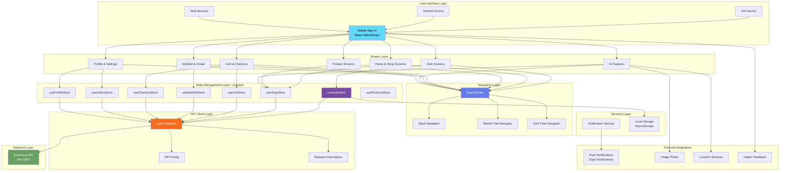

# Lufyco Clothing Frontend Architecture

## Architecture Diagram



---

## Detailed Architecture Explanation

### 1. **User Interface Layer** (React Native/Expo)

The frontend is a **cross-platform mobile application** built with React Native and Expo SDK 52.

#### Supported Platforms:
- **iOS**: iPhone and iPad (tablet support enabled)
- **Android**: Phones and tablets with adaptive icons
- **Web**: Progressive Web App via Metro bundler

#### Key Features:
- **Expo Router**: File-based routing system
- **Custom Splash Screen**: Branded splash screen with SLIC logo
- **Adaptive Icons**: Platform-specific app icons
- **Theme Support**: Dark and light mode support
- **Responsive Design**: Adapts to different screen sizes

---

### 2. **Screen Layer** (35+ Screens)

The app contains **39 distinct screens** organized into feature modules:

#### **Authentication Screens** (`screens/Auth/`)
- **IntroScreen**: Onboarding carousel with 3 slides
- **OffersScreen**: Special offers onboarding
- **PaymentsScreen**: Payment method onboarding
- **SignupScreen**: User registration with email verification
- **LoginScreen**: Email/password login
- **VerificationScreen**: OTP email verification
- **ForgotPasswordScreenFixed**: Password reset request
- **ForgotPasswordVerificationScreen**: OTP verification for password reset
- **ResetPasswordScreen**: New password entry
- **PasswordResetSuccessScreen**: Success confirmation

#### **Home & Shop Screens**
- **HomeScreen**: Dashboard with featured products and categories
- **CategoriesScreen**: Browse all product categories
- **ShopNewStylesScreen**: Featured new arrivals
- **ProductListingScreen**: Filtered product grid
- **MensWearScreen**: Men's fashion category
- **WomensWearScreen**: Women's fashion category
- **MenCasualShirtsScreen**: Specific category view
- **WomenTopsScreen**: Specific category view

#### **Product Screens**
- **ProductDetailsScreen**: Detailed product view with images, pricing, reviews
- **WomenTopDetailsScreen**: Specialized product detail view
- **SearchOverlay**: Search functionality overlay
- **FilterSheet**: Advanced filtering bottom sheet

#### **Cart & Checkout Screens** (`screens/Checkout/`)
- **MyCartScreen**: Shopping cart with quantity adjustment
- **CheckoutPaymentScreen**: Payment method selection
- Other checkout flow screens

#### **Profile & Settings Screens** (`screens/Profile/`)
- **ProfileScreen**: User profile dashboard
- **OrderHistoryScreen**: Past orders
- **ChangePasswordScreen**: Password update
- Additional profile management screens

#### **AI & Smart Features** (4 Advanced Screens)

##### **1. AIStylistScreen** - AI Dashboard (8,625 bytes)
Main hub for AI-powered fashion assistance:
- **Personalized Greeting**: Dynamic user name display
- **Quick Action Tiles**:
  - 🛍️ My Closet - Access virtual wardrobe
  - ☀️ Plan My Look - Event-based outfit planning
  - 💼 Shop New Styles - Browse new arrivals
  - 📅 Upcoming Events - View saved event outfits
- **Your Upcoming Looks**: Preview saved outfits for events
  - Outfit cards with item previews
  - Date and event information
  - Pagination (1 of 2)
- **Weather Integration**: Real-time weather display using `useWeather()` hook
  - Temperature display (°F)
  - Weather condition (Sunny/Cloudy with icons)
  - Dynamic icon colors

##### **2. PlanMyLookScreen** - Smart Outfit Planner (12,414 bytes)
AI-powered outfit planning based on multiple factors:

**Input Parameters:**
- **Mood Selection** (5 options with emojis):
  - 😊 Happy
  - 😎 Confident
  - ☹️ Sad
  - 😐 Tired
  - 😁 Excited
- **Occasion Selection** (5 categories):
  - Casual
  - Office
  - Party
  - Date
  - Wedding
- **Time Need** (2 options):
  - Now - Immediate outfit
  - Future - Schedule for later
- **Date & Time Picker**: 
  - Interactive calendar using `react-native-ui-datepicker`
  - Time picker for scheduled events
  - Minimum date: Today
  - Format: "DD MMM YYYY | hh:mm A"
- **Weather Display**: Real-time weather conditions
  - Temperature and conditions
  - Affects outfit recommendations

**Features:**
- Beautiful mood tiles with emoji icons on yellow backgrounds
- Chip-based selection with active state highlighting
- Date selector with calendar icon
- "Generate My Look" CTA button
- Navigation to SuggestedOutfitScreen with parameters

##### **3. SuggestedOutfitScreen** - AI Outfit Generator (11,605 bytes)
Intelligent outfit generation using AI algorithms:

**Algorithm Features:**
- **Weather-Based Logic**:
  - Cold weather (Rain/Snow/Fog/Cloud): Suggests hoodies, sweaters, jackets
  - Hot weather (Sunny/Clear): Suggests T-shirts, shorts, skirts, no jackets
- **Occasion-Based Filtering**:
  - **Office**: Formal tops, no T-shirts/hoodies, no shorts
  - **Party**: Prioritizes dresses and stylish pieces
  - **Casual**: Mixed items, comfortable wear
- **Outfit Assembly**:
  - Smart category filtering (Tops, Bottoms, Shoes, Outerwear, Dresses)
  - 30% chance for dress selection (if available)
  - Always includes shoes
  - Adds jacket/outerwear in cold weather
  - Randomized selection from filtered items
- **Mock Product Integration**: Uses `MOCK_PRODUCTS` data

**UI Components:**
- **Selection Pill**: Shows mood emoji + weather + occasion
- **Your Suggested Outfit Card**:
  - Image previews of each item
  - Item names
  - Scrollable horizontal layout
- **Complete Your Look Section**:
  - Accessory suggestions (watches, perfume)
  - "Add to Cart" buttons
  - "View More Suggestions" link
- **Action Buttons**:
  - "Try Again" - Regenerate outfit
  - "Save This Look" - Save to profile

**Data Flow:**
```
User Input (Mood + Occasion + Weather)
  ↓
Filter Products by Categories
  ↓
Apply Weather Logic
  ↓
Apply Occasion Logic
  ↓
Randomly Assemble Outfit
  ↓
Display with Accessories
```

##### **4. UpcomingEventsScreen** - Event Management (6,766 bytes)
View and manage saved outfits for upcoming events:
- Event calendar view
- Saved outfit previews
- Edit/delete event outfits
- Quick access to re-plan looks

#### **Wishlist & Closet**
- **WishlistScreen**: Saved favorite products
- **MyClosetScreen**: Virtual closet with user's purchased items
- **AddToClosetScreen**: Add items to virtual closet
- **AddToClosetPreviewScreen**: Preview before adding

#### **Utility Screens**
- **SplashScreen**: Initial loading screen
- **+not-found**: 404 error screen

---

### 3. **Navigation Layer** (Expo Router + React Navigation)

The app uses **Expo Router v4** with file-based routing combined with **React Navigation v7**.

#### **Navigation Structure:**

```
app/
├── _layout.tsx (Root layout)
├── (tabs)/ (Bottom tab navigator)
│   ├── index.tsx (Home tab)
│   ├── explore.tsx
│   └── profile.tsx
├── screens/ (Stack screens)
└── +not-found.tsx (404)
```

#### **Navigation Components:**

| Component | File | Purpose |
|-----------|------|---------|
| **AppNavigator** | `navigation/AppNavigator.tsx` | Main navigation orchestrator |
| **BottomTabNavigator** | `navigation/BottomTabNavigator.tsx` | Bottom tab bar with icons |
| **Expo Router** | Built-in | File-based routing |
| **Stack Navigator** | React Navigation | Screen stacking and transitions |

#### **Navigation Flow:**

```
1. App Launch
   ↓
2. Check Auth Status (Zustand)
   ↓
3. If NOT authenticated → Auth Flow (Intro → Signup → Login)
   ↓
4. If authenticated → Main App Flow (Bottom Tabs)
   ↓
5. Bottom Tabs: Home | Shop | Wishlist | Profile
```

---

### 4. **State Management Layer** (Zustand)

The app uses **Zustand v5** for lightweight, performant state management with **8 specialized stores**.

#### **Store Architecture:**

| Store | File | Responsibility | Persistence |
|-------|------|----------------|-------------|
| **useAuthStore** | `store/useAuthStore.ts` | Authentication, user session, login/signup | ✅ AsyncStorage |
| **useShopStore** | `store/useShopStore.ts` | Product catalog, categories, filtering | ❌ |
| **useCartStore** | `store/useCartStore.ts` | Shopping cart items, quantity, subtotal | ✅ AsyncStorage |
| **useWishlistStore** | `store/useWishlistStore.ts` | Wishlist items, favorites | ✅ AsyncStorage |
| **useCheckoutStore** | `store/useCheckoutStore.ts` | Checkout flow, shipping, payment | ❌ |
| **useOrdersStore** | `store/useOrdersStore.ts` | Order history, order tracking | ❌ |
| **useProfileStore** | `store/useProfileStore.ts` | User profile, settings | ✅ AsyncStorage |
| **useProductsStore** | `store/useProductsStore.ts` | Product details cache | ❌ |

#### **Store Persistence:**

Stores using **Zustand Persist Middleware** with **AsyncStorage**:
- Auth state (user, token, isAuthenticated)
- Cart items
- Wishlist items
- Profile settings

**Benefits:**
- Data survives app restarts
- Offline mode support
- Instant app startup with cached data

---

### 5. **`useAuthStore` Deep Dive**

The most critical store managing authentication flow:

#### **State:**
```typescript
{
  user: User | null,
  token: string | null,
  isAuthenticated: boolean,
  isOnboarded: boolean,
  loading: boolean,
  error: string | null
}
```

#### **Actions:**
- `signup()` - Register new user
- `login()` - Authenticate user
- `verifyEmail()` - Verify email with OTP
- `resendOTP()` - Resend verification code
- `requestPasswordReset()` - Initiate password reset
- `verifyResetOTP()` - Verify reset OTP
- `resetPassword()` - Set new password
- `logout()` - Clear session
- `completeOnboarding()` - Mark onboarding complete

#### **Authentication Flow:**

```
1. User enters signup details
   ↓
2. useAuthStore.signup() → POST /api/users/register
   ↓
3. Backend sends OTP email
   ↓
4. User enters OTP
   ↓
5. useAuthStore.verifyEmail() → POST /api/users/verify-email
   ↓
6. Verification success
   ↓
7. User can now login
   ↓
8. useAuthStore.login() → POST /api/users/login
   ↓
9. Store user data + token
   ↓
10. Navigate to main app
```

---

### 6. **API Client Layer** (Axios)

#### **Configuration** (`app/api/api.js`)

```javascript
const API_URL = Platform.OS === 'android' 
  ? 'http://10.0.2.2:5001/api'  // Android Emulator
  : 'http://localhost:5001/api'; // iOS/Web

const api = axios.create({
  baseURL: API_URL,
  headers: { 'Content-Type': 'application/json' }
});
```

#### **Platform-Specific URLs:**

| Platform | Base URL |
|----------|----------|
| **iOS Simulator** | `http://localhost:5001/api` |
| **Android Emulator** | `http://10.0.2.2:5001/api` |
| **Web** | `http://localhost:5001/api` |
| **Physical Device** | `http://<your-ip>:5001/api` |

#### **API Methods Used:**
- `api.post('/users/register')` - User registration
- `api.post('/users/login')` - User login
- `api.post('/users/verify-email')` - Email verification
- `api.get('/products')` - Fetch products
- `api.post('/users/forgot-password')` - Password reset
- And more...

---

### 7. **Services Layer**

#### **Notification Service** (`services/notificationService.ts`)

Manages push notifications using **Expo Notifications**.

**Features:**
- Request notification permissions
- Register for push tokens
- Handle incoming notifications
- Schedule local notifications
- Notification event listeners

**Key Functions:**
```typescript
- registerForPushNotificationsAsync()
- scheduleNotification()
- addNotificationReceivedListener()
- addNotificationResponseReceivedListener()
```

#### **Local Storage** (AsyncStorage)

Persistent key-value storage for:
- Auth tokens
- User preferences
- Cart data
- Wishlist items
- Onboarding status

---

### 8. **External Integrations**

#### **Expo Notifications** (`expo-notifications`)
- Push notification support
- Local notification scheduling
- Notification badges
- In-app notification display

#### **Image Picker** (`expo-image-picker`)
- Camera access
- Photo library access
- Used in profile picture upload
- Used in "Add to Closet" feature

#### **Location Services** (`expo-location`)
- Get device location
- Shipping address autocomplete
- Store locator (potential feature)

#### **Haptic Feedback** (`expo-haptics`)
- Button press feedback
- Success/error vibrations
- Enhanced UX interactions

#### **Other Integrations:**
- **expo-blur**: Glassmorphism effects
- **expo-device**: Device info detection
- **expo-linking**: Deep linking support
- **dayjs**: Date formatting

---

### 9. **Component Architecture**

#### **Reusable UI Components** (`components/`)

| Component | Purpose |
|-----------|---------|
| **VoucherCodeSheet** | Bottom sheet for promo codes |
| **Collapsible** | Expandable sections |
| **ThemedText** | Typography component |
| **ThemedView** | Styled container |
| **ParallaxScrollView** | Animated scroll effect |
| **HapticTab** | Tab with haptic feedback |

#### **Specialized UI Components** (`components/ui/`)
- Custom buttons
- Input fields
- Cards
- Modals

---

### 10. **Data Flow Examples**

### **Example 1: Product Browsing Flow**

```
1. User opens HomeScreen
   ↓
2. Component calls useShopStore.fetchProducts()
   ↓
3. Store dispatches GET /api/products via Axios
   ↓
4. Backend returns product array
   ↓
5. Store updates products state
   ↓
6. UI re-renders with product grid
   ↓
7. User taps product card
   ↓
8. Navigate to ProductDetailsScreen
   ↓
9. Display product details, images, reviews
```

### **Example 2: Add to Cart Flow**

```
1. User views ProductDetailsScreen
   ↓
2. User selects size, quantity
   ↓
3. User taps "Add to Cart"
   ↓
4. useCartStore.addToCart({ productId, size, quantity })
   ↓
5. Store updates cart state
   ↓
6. AsyncStorage persists cart data
   ↓
7. Show success animation
   ↓
8. Update cart badge count
```

### **Example 3: Checkout Flow**

```
1. User navigates to MyCartScreen
   ↓
2. Reviews cart items from useCartStore
   ↓
3. Taps "Proceed to Checkout"
   ↓
4. Navigate to CheckoutPaymentScreen
   ↓
5. User selects payment method
   ↓
6. useCheckoutStore.setPaymentMethod()
   ↓
7. User confirms order
   ↓
8. POST /api/orders/create
   ↓
9. Clear cart
   ↓
10. Navigate to OrderSuccessScreen
```

### **Example 4: AI Stylist Flow**

```
1. User opens AIStylistScreen
   ↓
2. User selects event type (Wedding, Party, etc.)
   ↓
3. User picks preferences (colors, style)
   ↓
4. App fetches matching products
   ↓
5. AI algorithm generates outfit combinations
   ↓
6. Display SuggestedOutfitScreen
   ↓
7. User can save to "My Looks" or add to cart
```

---

## Technology Stack Summary

| Layer | Technology | Version |
|-------|-----------|---------|
| **Framework** | React Native | 0.76.7 |
| **Platform** | Expo | 52.0.47 |
| **Language** | TypeScript | 5.3.3 |
| **Routing** | Expo Router | 4.0.17 |
| **Navigation** | React Navigation | 7.x |
| **State Management** | Zustand | 5.0.10 |
| **HTTP Client** | Axios | 1.7.9 |
| **Storage** | AsyncStorage | 2.2.0 |
| **Notifications** | Expo Notifications | 0.32.16 |
| **Animations** | React Native Reanimated | 3.16.1 |
| **Gestures** | React Native Gesture Handler | 2.20.2 |
| **Icons** | Expo Vector Icons | 14.0.2 |
| **Date Handling** | dayjs | 1.11.18 |

---

## Folder Structure

```
Lufyco_Frontend/
├── app/                          # Expo Router app directory
│   ├── (tabs)/                   # Bottom tab screens
│   ├── _layout.tsx               # Root layout
│   ├── screens/                  # All screen components
│   │   ├── Auth/                 # Authentication screens
│   │   ├── Checkout/             # Checkout flow
│   │   ├── Profile/              # Profile screens
│   │   ├── Shop/                 # Shop screens
│   │   └── *.tsx                 # Other screens
│   ├── store/                    # Zustand stores
│   │   ├── useAuthStore.ts
│   │   ├── useCartStore.ts
│   │   ├── useShopStore.ts
│   │   └── ...
│   ├── api/                      # API client config
│   │   └── api.js
│   ├── services/                 # App services
│   │   └── notificationService.ts
│   ├── navigation/               # Navigation configs
│   │   ├── AppNavigator.tsx
│   │   └── BottomTabNavigator.tsx
│   ├── context/                  # React contexts
│   ├── hooks/                    # Custom hooks
│   ├── models/                   # TypeScript interfaces
│   └── utils/                    # Utility functions
├── components/                   # Reusable components
│   ├── ui/                       # UI components
│   └── *.tsx
├── assets/                       # Images, fonts, icons
│   ├── images/
│   ├── fonts/
│   └── onboarding/
├── constants/                    # App constants
├── app.json                      # Expo configuration
├── package.json                  # Dependencies
└── tsconfig.json                 # TypeScript config
```

---

## Key Features Implemented

### ✅ **Authentication & Security** (10 Screens)
- **Email/Password Registration**: Full signup flow with validation
- **OTP Email Verification**: 6-digit codes with 10-minute expiry
- **Login with Persistent Sessions**: Token-based auth with AsyncStorage
- **Forgot Password Flow**: Complete 3-step password recovery
- **Password Reset with OTP**: Secure OTP verification
- **Offline Mode**: Test credentials (`user/user`) for development
- **Secure Token Storage**: Encrypted AsyncStorage
- **Email Provider Validation**: Supports Gmail, Yahoo, Outlook, etc.
- **Auto-login After Signup**: Seamless user experience
- **Password Visibility Toggle**: Eye icon for password fields

### ✅ **E-Commerce Functionality** (15+ Screens)
- **Product Browsing**: Grid and list views with infinite scroll
- **Advanced Search**: Search overlay with autocomplete
- **Image Search**: 
  - Upload or capture image to find similar products
  - Visual similarity matching
  - Camera integration via `expo-image-picker`
  - Photo library access
  - AI-powered image recognition (planned)
- **Category Filtering**: Men's/Women's wear with subcategories
- **Filter Sheet**: Price, size, color, brand filters
- **Product Details**: 
  - High-resolution image gallery
  - Size selector with stock status
  - Quantity picker
  - Reviews and ratings
  - Similar products
  - Scale animation on "Add to Cart"
- **Shopping Cart**: 
  - Quantity adjustment (+/-)
  - Item removal swipe gesture
  - Subtotal calculation
  - Promo code application via VoucherCodeSheet
  - Success overlay on add to cart
- **Wishlist/Favorites**: 
  - Heart icon toggle
  - Persistent across sessions
  - Quick add to cart from wishlist
- **Checkout Flow** (5 screens):
  - Cart review
  - Shipping address
  - Payment method selection (COD, Card, PayPal)
  - Order summary
  - Success confirmation
- **Order History**: 
  - Past orders with status
  - Order tracking
  - Reorder functionality
  - Invoice download

### ✅ **AI-Powered Features** (4 Advanced Screens)
- **AI Stylist Dashboard**: 
  - Personalized recommendations based on user profile
  - Weather-integrated suggestions
  - Quick access tiles
- **Plan My Look**: 
  - 5 mood options with emoji selection
  - 5 occasion categories
  - Date/time picker for future events
  - Weather integration for smart suggestions
- **Suggested Outfit Generator**:
  - AI algorithm with weather-based logic
  - Occasion-appropriate filtering
  - Smart category matching (tops, bottoms, shoes, outerwear)
  - Accessory recommendations
  - "Try Again" regeneration
  - Save to profile
- **Virtual Closet Management**: 
  - Add purchased items
  - View wardrobe
  - Outfit history
- **Upcoming Events**: 
  - Calendar view
  - Saved event outfits
  - Quick re-planning

### ✅ **User Experience Enhancements**
- **Onboarding Carousel**: 
  - 3 beautiful slides (Intro, Offers, Payments)
  - Pagination dots with active state
  - Skip and Next buttons
  - Custom images
- **Navigation**:
  - Bottom tab navigation with icons
  - Stack navigation for flows
  - Modal overlays
  - Deep linking support (`myapp://`)
- **Haptic Feedback**: 
  - Button presses
  - Success/error vibrations
  - Tab switches
- **Loading States**:
  - Skeleton screens
  - Spinner animations
  - Progress indicators
- **Error Handling**:
  - User-friendly error messages
  - Retry mechanisms
  - Offline mode fallback
- **Success Animations**:
  - Scale animations
  - Fade transitions
  - Success overlays
- **Gestures**:
  - Pull-to-refresh on product lists
  - Swipe to delete cart items
  - Swipe carousel for product images
  - Gesture handler integration

### ✅ **Notification System**
- **Push Notifications** (Expo Notifications):
  - Permission requests
  - Push token registration
  - Notification badges
- **Notification Types**:
  - Order updates (Processing, Shipped, Delivered)
  - Promotional offers
  - Cart reminders (abandoned cart recovery)
  - Wishlist restocks (when item back in stock)
  - Flash sales alerts
- **In-App Display**: 
  - Notification center
  - Unread badges
  - Notification history

### ✅ **Additional Features**
- **Profile Management**:
  - Edit profile
  - Change password
  - Address book
  - Saved payment methods
  - Preferences
- **Image Handling**:
  - Image picker for profile
  - Camera access
  - Photo library
  - Image optimization
- **Location Services**:
  - Auto-detect location
  - Shipping address suggestions
  - Store locator (planned)
- **Date/Time Management**:
  - dayjs integration
  - Relative time displays
  - Calendar picker
  - Time zone handling

---

## State Persistence Strategy

### **Persisted Data** (Survives app restarts)
- ✅ User authentication state
- ✅ Shopping cart items
- ✅ Wishlist items
- ✅ Onboarding completion status
- ✅ User preferences

### **Transient Data** (Cleared on restart)
- ❌ Product catalog (fetched fresh)
- ❌ Checkout state
- ❌ Order history (fetched when needed)
- ❌ Search history

---

## Navigation Patterns

### **Stack Navigation**
Used for sequential flows:
- Auth flow: Intro → Signup → Verification → Login
- Checkout flow: Cart → Shipping → Payment → Confirmation
- Product flow: List → Details → Reviews

### **Tab Navigation**
Bottom tabs for main sections:
- Home 🏠
- Shop 🛍️
- Wishlist ❤️
- Profile 👤

### **Modal Navigation**
Overlays for temporary actions:
- Search overlay
- Filter sheet
- Voucher code entry
- Product quick view

---

## Performance Optimizations

### **Image Optimization**
- Lazy loading for product images
- Image caching
- Responsive image sizes
- WebP format support

### **List Virtualization**
- FlatList for product grids
- Optimized rendering
- Pagination support
- Infinite scroll

### **State Management**
- Zustand for minimal re-renders
- Memoization of expensive computations
- Selective state updates
- Store splitting (8 specialized stores)

### **Code Splitting**
- Lazy loading of screens
- Dynamic imports
- Route-based splitting via Expo Router

---

## Offline Capabilities

### **Offline Mode Features**
1. **Cached Product Data**: Previously viewed products available
2. **Wishlist Access**: View saved items offline
3. **Cart Persistence**: Cart data saved locally
4. **Offline Login**: Test mode with `user/user` credentials
5. **AsyncStorage**: All persisted data accessible

### **Online-Required Features**
- Product search
- New product fetching
- Order placement
- Email verification
- Password reset

---

## Error Handling Strategy

### **Network Errors**
- Axios interceptors catch HTTP errors
- User-friendly error messages
- Retry mechanisms
- Offline mode fallback

### **Validation Errors**
- Form validation before submission
- Real-time input validation
- Error messages below fields
- Disabled submit buttons

### **Authentication Errors**
- Token expiration handling
- Auto-logout on 401
- Redirect to login
- Session restoration

---

## Security Best Practices

> [!IMPORTANT]
> **Current Implementation**

- ✅ HTTPS-ready API client
- ✅ Token-based authentication
- ✅ Secure AsyncStorage
- ✅ Input validation
- ✅ OTP verification

> [!WARNING]
> **Production Enhancements Needed**

- ⚠️ Add SSL pinning for API calls
- ⚠️ Implement JWT refresh tokens
- ⚠️ Add biometric authentication
- ⚠️ Enable code obfuscation
- ⚠️ Add app integrity checks

---

## Development Workflow

### **Starting the App**

```bash
# Install dependencies
npm install

# Start Expo dev server
npm start

# Run on iOS simulator
npm run ios

# Run on Android emulator
npm run android

# Run on web
npm run web
```

### **Build Process**

```bash
# Development build
expo build

# Production build
expo build:android
expo build:ios

# Web build
expo export:web
```

---

## App Configuration (`app.json`)

```json
{
  "expo": {
    "name": "FashionApp",
    "slug": "FashionApp",
    "version": "1.0.0",
    "orientation": "portrait",
    "scheme": "myapp",
    "newArchEnabled": true,
    "plugins": [
      "expo-router",
      "expo-splash-screen"
    ]
  }
}
```

**Key Settings:**
- **New Architecture**: Enabled for performance
- **File-based Routing**: Expo Router integration
- **Custom Splash Screen**: Branded loading screen
- **Deep Linking**: `myapp://` URL scheme

---

## Platform-Specific Considerations

### **iOS**
- Tab bar icons use SF Symbols
- Native haptic feedback
- Adaptive layout for iPad
- StatusBar style Auto

### **Android**
- Material Design components
- Adaptive icon support
- Back button handling
- Notification channels

### **Web**
- Metro bundler for static export
- Responsive breakpoints
- No native features (camera, haptics)
- PWA support

---

## Testing Strategy

### **Unit Tests** (Jest + React Test Renderer)
```bash
npm test
```

Test coverage for:
- Zustand stores
- Utility functions
- Custom hooks
- Components

### **E2E Tests** (Planned)
- Authentication flows
- Product purchase journey
- Cart operations
- Navigation flows

---

## Future Enhancements

### **Planned Features**
1. **Social Login**: Google, Facebook, Apple
2. **Payment Integration**: Stripe, PayPal
3. **Order Tracking**: Real-time status updates
4. **Product Reviews**: User ratings and comments
5. **AR Try-On**: Virtual fitting room
6. **Live Chat**: Customer support
7. **Referral Program**: Invite friends
8. **Loyalty Points**: Rewards system

### **Performance Improvements**
- Implement React Query for server state
- Add Redis caching
- Optimize bundle size
- Implement code splitting
- Add performance monitoring (Sentry)

---

## Conclusion

The Lufyco Clothing frontend is a **modern, full-featured e-commerce mobile app** built with:

✅ **React Native + Expo** for cross-platform support  
✅ **Zustand** for efficient state management  
✅ **Expo Router** for file-based navigation  
✅ **TypeScript** for type safety  
✅ **AI-powered features** for personalized shopping  
✅ **Comprehensive authentication** with email verification  
✅ **Offline support** with AsyncStorage persistence  
✅ **Rich UX** with animations and haptic feedback  

The architecture is **scalable**, **maintainable**, and ready for **production deployment** with some security enhancements.
